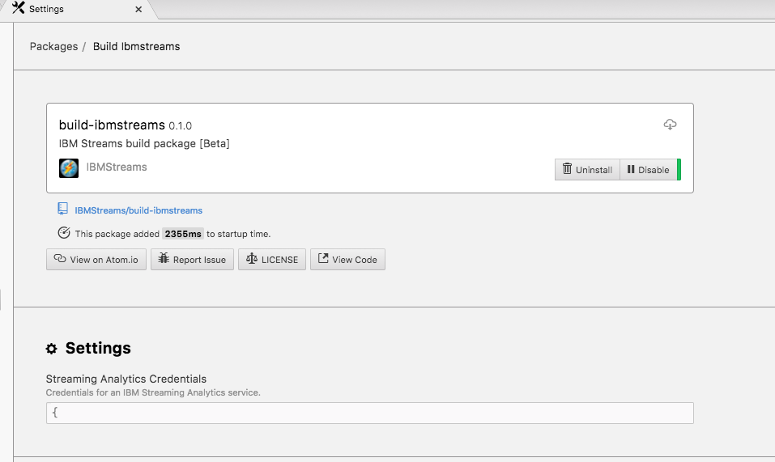
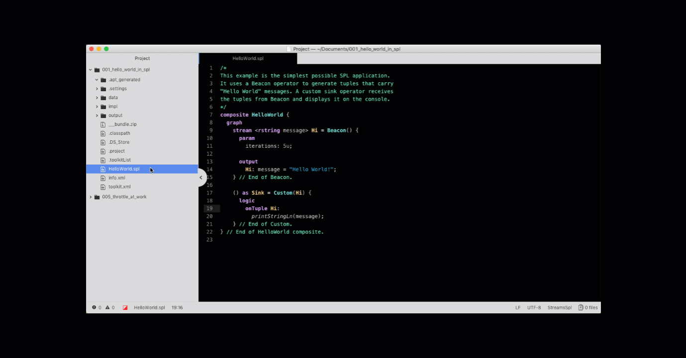

# build-ibmstreams [Beta]
IBM Streams build extension for Atom

### Beta
This is the initial public release.  For best results you should also install these Atom packages:
* language-ibmstreams-spl
* streams-dark-syntax
* streams-light-syntax
* atom-ide-ui
* ide-ibmstreams

### Setup Instructions

### Build

You may either build and run your Streams applications on an [IBM Cloud Streaming Analytics service](https://cloud.ibm.com/docs/services/StreamingAnalytics/index.html#gettingstarted) (V4.3) or an [IBM Cloud Private for Data (ICP4D) Streams add-on instance](https://www.ibm.com/support/knowledgecenter/SSQNUZ_current/com.ibm.icpdata.doc/streams/intro.html) (V5).

#### IBM Cloud: Streaming Analytics service
A running IBM Streaming Analytics service is required. You must provide your service credentials (in JSON format) in order for this extension to connect to your service. SPL applications will be built and deployed on this service. If you need to create one, start [here](https://cloud.ibm.com/catalog/services/streaming-analytics) and follow the instructions to create an account.

<b>Note:</b>The service needs to support V2 of the rest api.

Once you have an account go to your [Dashboard](https://cloud.ibm.com/resources?groups=resource-instance) and select the Streaming Analytics service you want to use. Ensure that it is running and then create a new set of credentials. Select the __Service credentials__ tab on the left and select your existing credentials or click on the __New credential__ button. On the credentials page, click on the __View credentials__ action and click on the __Copy__ button in the top-right corner of the credentials snippet to copy them to the clipboard.

In Atom, to open __build-ibmstreams__ package settings go to Atom->Preferences->Packages and press the Settings button on the build-ibmstreams package. Select __IBM Cloud Streaming Analytics service__ in the __Build and submit__ dropdown and then paste your credentials in the __Streaming Analytics Credentials__ field.

#### IBM Cloud Private for Data: Streams add-on instance

A provisioned IBM Streams add-on is required. You must provide your IBM Cloud Private for Data URL in order for this extension to connect to your add-on instance. Enter your url in the __build-ibmstreams__ package settings and select __IBM Cloud Private for Data Streams addon__.

If you need to provision an add-on, start [here](https://www.ibm.com/support/knowledgecenter/SSQNUZ_current/com.ibm.icpdata.doc/streams/intro.html) and follow the instructions.

### SPL Application build

